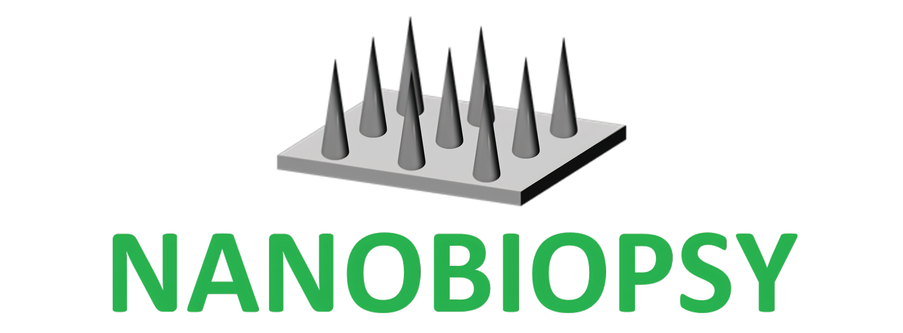

# Nondestructive Spatial Lipidomics for Glioma Classification - Tissue Similarity and Grading
Davide Alessandro Martella1, Leor Ariel Rose2, Nadia Rouatbi3, Chenlei Gu1, Valeria Caprettini1, Magnus Jensen1, Cathleen Hagemann1,4, Andrea Serio1,4, Khuloud Al-Jamal3, Mads Bergholt1, Paul Brennan5, Assaf Zaritsky2, Ciro Chiappini1,6

1. Centre for Craniofacial and Regenerative Biology, King’s College London, SE1 9RT, London, UK.
2. Department of Software and Information Systems Engineering, Ben-Gurion University of the Negev, Be'er Sheva, 8410501 Israel.
3. Institute of Pharmaceutical Sciences, King’s College London, SE1 9NQ, London, UK.
4. The Francis Crick Institute, NW1 1AT, London, UK.
5. Centre for Clinical Brain Sciences, University of Edinburgh, EH16 4SB, Edinburgh, UK.
6. London Centre for Nanotechnology, King’s College London, WC2R 2LS, London, UK.

## Repository contents
This repository contains code for the tissue similarity and grading of DESI human glioma nanobiopsy part of the paper "Nondestructive Spatial Lipidomics for Glioma Classification".

[Main Python file](./main.py) - contains the main code to run the processing, correlation and classification analysis for the DESI human glioma nanobiopsy.

[Processing folder](./processing) - contains the processing code.

[Correlation analysis folder](./correlation) - contains the correlation analysis code.

[Classification analysis folder](./classification) - contains the classification analysis code.

[Figure creation file](./visualization.ipynb) - contains the figure creation code.

[Figure creation file](./esi_data_analysis.py) - contains the code for ESI data analysis and figure creation.

[Figure creation file](./liver_data_analysis.py) - contains the code for DESI Liver data analysis and figure creation.

[Figure creation file](./chip_typesdata_analysis.py) - contains the code for DESI chip types data analysis and figure creation.

## Prerequisite
Before running th coes you should acquire the data (details in th paper). Main code code requires the DESI-MS Human Glioma dataset, folder structures should be as follows:

      .
      ├── data
      │   ├── DHG
      │   │   └── raw
      │   │       ├── HG 1-r.ibd
      │   │       ├── HG 1-r.ibh
      │   │       ├── HG 1-r.imzML
      │   │       ├── HG 1-s.ibd
      │   │       ├── HG 1-s.imzML
      │   │       ├── ...
      │   └── metadata.csv
      └── SLGC-tissue-similarity-and-grading

ESI data analysis and figure creation requires the ESI dataset, folder structures should be as follows:
 
      .
      ├── data
      │   └── ESI
      │       ├── 201303 BRAIN TISSUE 2_1.mzML
      │       ├── 201303 BRAIN TISSUE 3-2.mzML
      │       ├── 201303 NO SCRAPPING REPLICA 1.mzML
      │       ├── 201303 NO SCRAPPING REPLICA 2.mzML
      │       └── 201303 NO SCRAPPING REPLICA 3.mzML
      └── SLGC-tissue-similarity-and-grading

DESI liver data analysis and figure creation requires the DESI Liver dataset, folder structures should be as follows:
 
      .
      ├── data
      │   ├── LIVER
      │   │   └── raw
      │   │       ├── 220224-optimization-liver-optimised-1 Analyte 1_1.ibd
      │   │       ├── 220224-optimization-liver-optimised-1 Analyte 1_1.imzml
      │   │       ├── 220224-optimization-liver-standard-1 Analyte 1_1.ibd
      │   │       └── 220224-optimization-liver-standard-1 Analyte 1_1.imzml
      │   └── metadata.csv
      └── SLGC-tissue-similarity-and-grading

And lastly chip types data analysis and figure creation requires the DESI chip types dataset, folder structures should be as follows:
 
      .
      ├── data
      │   ├── CHIP_TYPES
      │   │   └── raw
      │   │       ├── 20230606-4chips Analyte 1_1.ibd
      │   │       ├── 20230606-4chips Analyte 1_1.imzml
      │   │       ├── 20230607-4chips+-t2-3-s+pp Analyte 1_1.ibd
      │   │       ├── 20230607-4chips+-t2-3-s+pp Analyte 1_1.imzml
      │   │       ├── 20230709-4chips Analyte 1_1.ibd
      │   │       ├── 20230709-4chips Analyte 1_1.imzml
      │   │       ├── 20230709-4chips_s_tissue Analyte 1_1.ibd
      │   │       ├── 20230709-4chips_s_tissue Analyte 1_1.imzml
      │   │       ├── 20230727 4chips no freezer Analyte 1_1.ibd
      │   │       ├── 20230727 4chips no freezer Analyte 1_1.imzml
      │   │       ├── 20230727 4chips no freezer tissue Analyte 1_1.ibd
      │   │       └── 20230727 4chips no freezer tissue Analyte 1_1.imzml
      │   └── metadata.csv
      └── SLGC-tissue-similarity-and-grading

## Project setup and run:

1. Clone this repository.
2. Open cmd/shell/terminal and go to project folder: `cd SLGC-tissue-similarity-and-grading`
3. Create a conda environment: `conda env create -f environment.yml`
4. Activate the conda environment `conda activate tfgpu_jup`
5. Run `python main.py`
6. Run `visualization.ipynb` Jupyter notebook.
7. Run `esi_data_analysis.py`
8. Run `liver_data_analysis.py`
9.Run `chip_types_data_analysis.py`

## Citation
If you use this code, please cite: 

> Martella, D. A., Rose, L. A., Rouatbi, N., Gu, C., Caprettini, V., Jensen, M., ... & Chiappini, C. (2023). Nondestructive Spatial Lipidomics for Glioma Classification. bioRxiv, 2023-03

Please contact leor.rose@gmail.com or assafzar@gmail.com for bugs or questions.
